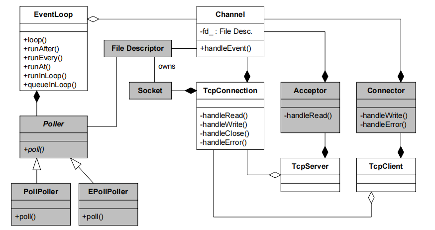

#### epoll

epoll初始化用epoll_create创建一个event_poll对象，这个对象有就绪列表（rdllist）,红黑树（rbr）、等待队列。就绪列表存放就绪的socket，红黑树存放所有正在监听的socket引用，等待列表放正在等待的进程。

创建epoll对象后，可以用epoll_ctl添加或删除所要监听的socket。注意，是将eventpoll添加到socket 的等待队列中。

当一个进程调用epoll_wait，如果rdlist已经引用了socket，那么epoll_wait直接返回，如果rdlist为空，内核将进程加入epoll的等待队列，阻塞进程。

当socket接收到数据时，中断程序就会将该socket放入就绪列表rbllist（调用回调函数），并且唤醒等待队列中阻塞的进程，进程A进入运行状态，轮询rblist从而知道哪些socket发送了变化

## 第一部分C++多线程系统编程

### 1.线程安全的对象生命周期管理

==如何安全的构造：==对象构造要做到线程安全，唯一的要求是在构造期间不要泄露 this 指针（即使是最后一行），因为在构造函数执行期间对象还没有完成初始化，如果 this被泄露（escape）给了其他对象（其自身创建的子对象除外），那么别的线程有可能访问这个半成品对象。

一个函数如果要锁住相同类型的多个对象，为了保证始终按相同的顺序加锁，我
们可以比较 mutex 对象的地址，始终先加锁地址较小的 mutex。

==如何安全的析构==：mutex只能同步其余成员函数。应该采用shared_ptr、weak_ptr。

```c_cpp
// 线程安全的观察者模式
class Observer:public std::enabled_shared_from_this<Observer>{ // 获取指向自身的shared_ptr
public:
  Observer(): m_subject{nullptr}{};
  virtual ~Observer() = default;
  virtual void update() = 0;
  void observe(Observable* s);
  
protected:
  Observable* m_subject; // 注意确保Observable声明周期长于Observer
}
void Observer::observe(Observable* s) {
  s->register_(shared_from_this()); // 注意Observer也要是通过std::shared_ptr创建
  m_subject = s;
}
class Observable{
public:
  void register_(const std::weak_ptr<Observer>& x);
  void notifyObservers();
private:
  std::vector<std::weak_ptr<Observer>> m_vecObservers;
  mutable std::mutex mtx;
}
void Observable::notifyObservers() {
  std::lock_guard<std::mutex> lock(mtx);
  for (auto it = m_vecObservers.begin(); it != m_vecObservers.end();) {
    std::shared_ptr<Observer> obj(it->lock());
    if (obj) {
      obj->update();
      it++;
    } else {
      it = m_vecObservers.erase(it);
    }
  }
}
void Observable::register_(const std::weak_ptr<Observer>& x){
  m_vecObservers.push_back(x);
}
```

常见内存问题与解决方案：

1. 缓冲区溢出：用 std::vector<char>/std::string 或自己编写 Buffer class 来
管理缓冲区，自动记住用缓冲区的长度，并通过成员函数而不是裸指针来修改
缓冲区。
2. 空悬指针/野指针：用 shared_ptr/weak_ptr，这正是本章的主题。
3. 重复释放：用 unique_ptr，只在对象析构的时候释放一次。
4. 内存泄漏：用 unique_ptr，对象析构的时候自动释放内存。
5. 不配对的 new[]/delete：把 new[] 统统替换为 std::vector/uniqued_array。

==std::enable_shared_from_this==

当我们希望将一个对象this指针交给shared_ptr管理时，不能直接通过this构造（会生成新 的控制块），需要将该类继承std::enable_shared_from_this，并且从shared_from_this()中获得shared_ptr指针。

原理是使用shared_ptr构造继承了enable_shared_from_this的类时，enable_shared_from_this内部有一个weak_ptr成员，当调用调用shared_ptr构造函数时会初始化该成员，在调用shared_from_this时会调用weak_ptr的lock方法。因为weak_ptr需要

==实现弱回调==

什么是回调（callback）：一个函数中调用另一个函数。C++中提供的优雅方案是利用std::function和std::bind来表示通用的可调用函数。

弱回调：一个函数调用另一个对象的成员函数，需要保证另一个对象的生命周期，否则可能coredump，我们可以使用shared_ptr，把 shared_ptr 绑（boost::bind）到 boost:function 里，那么回调的时候 StockFactory 对象始终存在，是安全的。但是这样会延迟对象的生命周期。

更好的方法是“如果对象还活着，调用其成员函数，否则忽略之”，这就是弱回调。可以利用weak_ptr实现，把weak_ptr传入std::function，在function中先尝试提升，提升成功执行回调，否则就跳过即可。

==观察者模式局限==

Observer 模式的本质问题在于其面向对象的设计。即必须继承Observer基类，这样会限制成员函数名字（例如都是update）、参数、返回值，在观察多个同一类型的事件时也不方便。现在C++ 方法可以利用std::function来绕过这些限制。

## 第二部分muduo网络库

前向声明：告诉编译器“某名字存在”，但不给完整定义。可以减少头文件以来、加速编译。

前向声明的类是不完整类型，可以用来声明指针、引用、作为函数参数、返回值等。但是不能够定义对象、访问对象成员以及继承和seizeof。



类图如上，注意聚合和组合的区别，聚合和组合都是整体与部分（整体 has a 部分）的关系。聚合部分可以离开整体而单独存在(生命周期不一致)。组合部分不能离开整体而单独存在（生命周期一致）。

==基于事件的非阻塞网络编程(Reactor)==

背景：传统阻塞模型每个连接一个线程， 同时采用阻塞等待新连接、阻塞读取数据与写回数据。效率太低。

核心思想：不阻塞等待 I/O，即程序主体是被动等待事件发生，事件发生之后网络库会调用（回调）事先注册的事件处理函数（event handler）。

实现上，使用epoll_wait阻塞等待，一旦唤醒，所有io操作都是非阻塞的（有数据/有连接），并且可以有一个线程处理多个连接。（epoll中可以监听多个fd）。

==HTTP服务器编程模型==

|序号|并发模型|阻塞 I/O|开销|特点|
|--|--|--|--|--|
|0|accept/read/write|是|低|一次服务一个客户端|
|1|accept/fork|是|高|process-per-connection|
|2|accept/thread|是|中|thread-per-connection|
|3|prefork|是|高||
|4|prethreaded|是|中|线程池（预创建）|
|5|poll (reactor)|否|低|单线程 reactor 模型|
|6|reactor + thread-per-task|否|中|单线程处理事件，任务分发给线程|
|7|reactor + worker thread|否|中|交个单个工作线程进行计算任务保证顺序性|
|8|reactor +  thread poll|否|低|主线程IO，工作线程计算(线程池)|
|9|reactors in threads|否|低|main Reactor+sub Reactors (netty,muduo)也就是one loop per thread|
|10|reactors in process|否|低|工作进程相互独立，可以热升级|
|11|reactors + thread pool|否|低|最灵活的 I/O 与 CPU 配置(8+9)|

==IO多路复用==

背景： TCP 是个全双工协议，同时支持 read() 和 write()操作，当一个线程/进程阻塞在 read() 上，但程序又想给这个 TCP 连接发数据，那该怎么办？一种方案是用两个线程/进程。另一种方法则是复用一个线程，使用 IO multiplexing，也就是 select/poll/epoll/kqueue 这一系列的“多路选择器”，让一个 thread of control 能处理多个连接。

io多路复用时，一般是在一个大循环中监听fd/socket等待事件发送，随后处理对应的业务逻辑。Doug Schmidt 指出，其实网络编程中有很多是事务性（routine）的工作，可以提取为公用的框架或库，而用户只需要填上关键的业务逻辑代码，并将回调注册到框架中，就可以实现完整的网络服务，这便是Recator的思想。

单线程 Reactor 的程序执行顺序：在没有事件的时候，线程等待在 select/poll/epoll_wait 等函数上。事件到达后由网络库处理 IO，再把消息通知（回调）客户端代码。Reactor 事件循环所在的线程通常叫 IO 线程。通常由网络库负责读写 socket，用户代码负载解码、计算、编码。

==muduo多线程模型==

方案 9 这是 muduo 内置的多线程方案，也是 Netty 内置的多线程方案。这种方案的特点是 one loop per thread，有一个 main Reactor 负责 accept(2) 连接，然后把连接挂在某个 sub Reactor 中（muduo 采用 round-robin 的方式来选择 sub Reactor），这样该连接的所有操作都在那个 sub Reactor 所处的线程中完成。多个连接可能被分派到多个线程中，以充分利用 CPU。

muduo 采用的是固定大小的 Reactor pool，池子的大小通常根据 CPU 数目确定，也就是说线程数是固定的，这样程序的总体处理能力不会随连接数增加而下降。另外，由于一个连接完全由一个线程管理，那么请求的顺序性有保证，突发请求也不会占满全部 8 个核（如果需要优化突发请求，可以考虑方案 11）。这种方案把 IO 分派给多个线程，防止出现一个 Reactor 的处理能力饱和。

与方案 8 的线程池相比，方案 9 减少了进出 thread pool 的两次上下文切换，在把多个连接分散到多个 Reactor 线程之后，小规模计算可以在当前 IO 线程完成并发回结果，从而降低响应的延迟。我认为这是一个适应性很强的多线程 IO 模型，因此把它作为 muduo 的默认线程模型

如何设置event loop数量：

ZeroMQ 的手册给出的建议是 按照每千兆比特每秒的吞吐量配一个 event loop 的比例来设置event loop 的数目。千兆以太网上的网络程序时，用一个 event loop 就足以应付网络IO。

## 第三部分 工程实践论